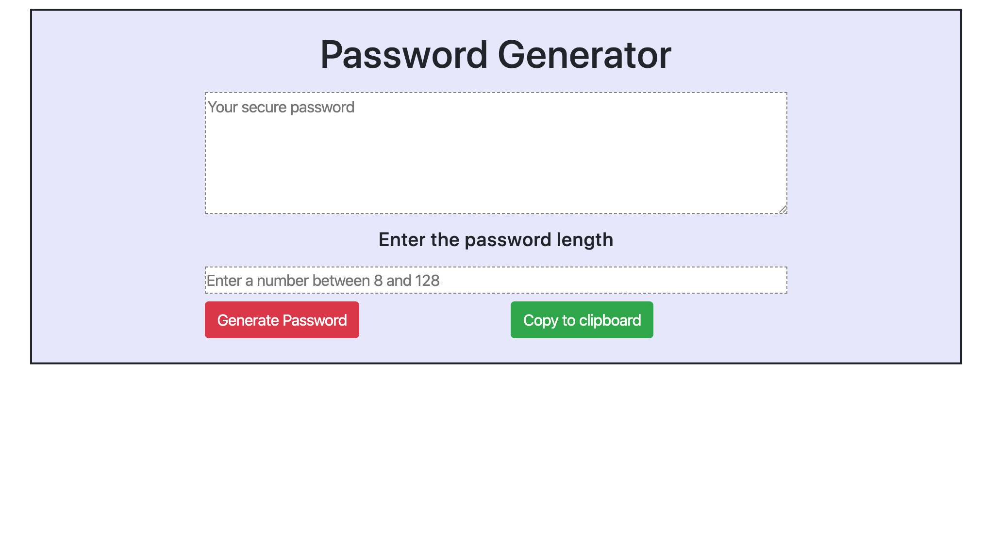
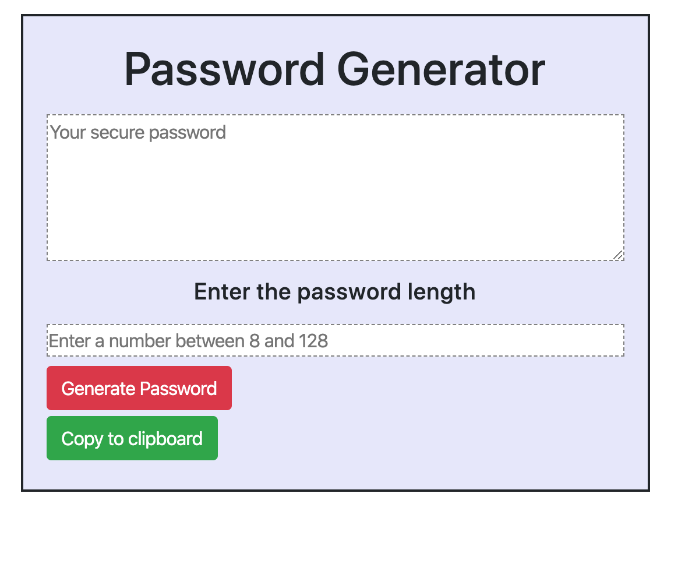
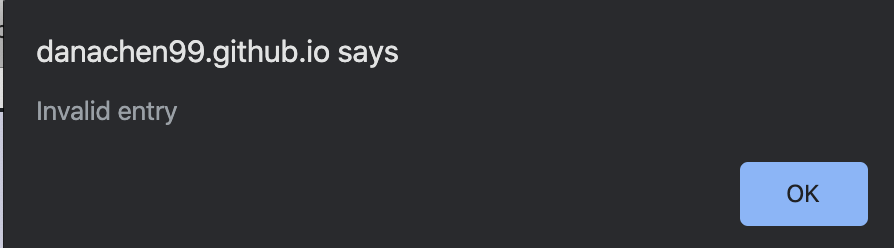
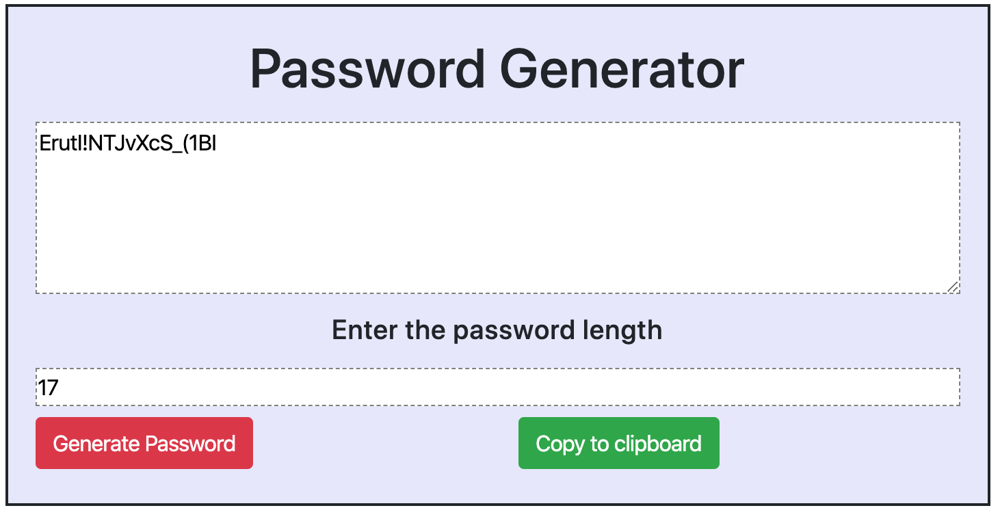
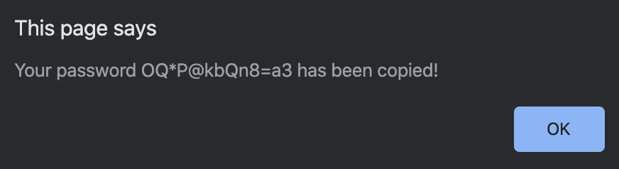

# Homework-three
## Random Password Generator

The purpose of this project is to create a random password generator. The characters included are special characters, lower case letters, uppercase letters, and numeric values. It is important that passwords be at least eigth characters long so that they are harder to guess/penetrate, especially if it's made up of upper and lowercase letters and numbers and/or symbols. The combination of various types of characters creates a strong password compared to a weak password containing only letters. 

The application contains an alert for the user when they input a number outside of the parameters (8 and 128) and when the user tries to generate a password without entering a value. After the value is input, the user can generate a password which will appear in the textarea. Although the user can manually select all and copy from the textarea, the copy to clipboard function is a faster way of doing so, and ensures that the entire password is copied. Once copied to clipboard, the page will alert the user to let them know it has been copied and verifies the password.

Overall, users can use the generator to create random passwords that can be copied and saved to their prefered safe location. The purpose is for users to have a truly randomized password that is strong and can be of any desired length between 8 and 128 characters. 

### Link to Deployed Github Pages
https://danachen99.github.io/homework-three/ 

#### Images
Images of Password Generator  

